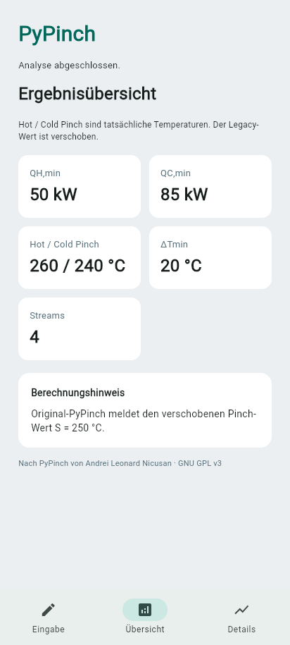

# PyPinch

PyPinch ist eine lokale Anwendung für die Pinch-Analyse von Prozessströmen.
Sie übernimmt die Berechnungen des [ursprünglichen PyPinch-Projekts](https://github.com/anicusan/PyPinch)
in einen Flet-basierten, responsiven Editor. Eingaben und Berechnung bleiben
im jeweiligen App-Prozess; ein Konto oder Analyseserver ist nicht nötig.

Die Anwendung bietet manuelle Stromeingabe, bearbeitbaren CSV-Import,
Validierung, QH,min und QC,min, Pinch-Temperaturen, Problem Table,
Wärmekaskaden, Composite Curves, Grand Composite Curve und CSV-Exporte.
Temperaturen sind in °C, Wärmekapazitätsströme CP in kW/°C und Wärmeströme
in kW angegeben. Der angezeigte Hot-/Cold-Pinch ist vom verschobenen
Legacy-Wert unterschieden.



## Schnellstart

Python 3.12 und [uv](https://docs.astral.sh/uv/) installieren. Die folgenden
Befehle in PowerShell im heruntergeladenen oder geklonten Projektordner ausführen.

### Web-Version im Browser

```powershell
uv sync --frozen
uv run flet run --web --recursive --ignore-dirs .flet,__pycache__ --port 8550 src/main.py
```

Im Browser `http://localhost:8550/` öffnen und das Terminal geöffnet lassen.
Im Editor „Beispiel laden“ wählen, dann „Analyse starten“.
Der Entwicklungsserver lädt Python-Änderungen in
Untermodulen neu. Das Ignorieren von `.flet` verhindert eine Neustartschleife
durch generierte Flet-Dateien.

### Android-Vorschau mit QR-Code

```powershell
uv sync --frozen
uv run flet run --android --recursive --ignore-dirs .flet,__pycache__ --port 8551 src/main.py
```

Der letzte Befehl zeigt den QR-Code im Terminal an. Diesen mit der
Flet-Companion-App auf dem Android-Gerät scannen. Rechner und Gerät müssen
im selben WLAN sein; das Terminal geöffnet lassen. Port 8551 lässt die
Web-Version parallel laufen. Diese Vorschau benötigt den Entwicklungsrechner;
sie ist kein Offline-APK-Test.

### Desktop-Fenster

Im Projektordner ausführen:

```powershell
uv run flet run --recursive --ignore-dirs .flet,__pycache__ src/main.py
```

Die laufende Vorschau lässt sich im jeweiligen Terminal mit `Strg+C` beenden.

In VS Code stehen die gleichen Befehle unter **Terminal → Aufgabe ausführen**
in `.vscode/tasks.json` bereit. Für Python-Debugging die `.venv` als
Interpreter wählen und „PyPinch: Desktop debuggen“ starten.

## CSV-Format

Der Import akzeptiert UTF-8, optional mit BOM, und das Format des
Originalprojekts. Die originale erste Zeile `Tmin, 20, ` mit abschließendem
leeren Feld wird ebenfalls akzeptiert.

```csv
Tmin,20
CP,TSUPPLY,TTARGET
1,350,120
3,260,150
2,65,310
0.5,100,170
```

`Tmin` bezeichnet ΔTmin in °C. `CP` ist in kW/°C, Supply und Target in °C.
Supply > Target ergibt einen heißen, Supply < Target einen kalten Stream.
Mindestens zwei Streams, CP > 0, endliche Zahlen, verschiedene Supply- und
Target-Temperaturen sowie ΔTmin ≥ 0 sind erforderlich. Importierte Streams
erscheinen im normalen Editor und können geändert werden.

## Tests und Qualität

```powershell
uv run pytest -q
uv run ruff check src tests scripts
uv run ruff format --check src tests scripts
uv export --frozen --no-emit-project --output-file build/audit-requirements.txt
uvx --from pip-audit==2.10.1 pip-audit --disable-pip --require-hashes --strict -r build/audit-requirements.txt
```

Die Golden-Tests sichern die Original-Beispiele und ihre Zwischenwerte ab.
Die Composite Curves verwenden korrigierte Startpunkte; zusätzliche Tests
prüfen tatsächliche Pinch-Temperaturen, Temperaturbereiche ohne Wärmeaustausch,
Extremwerte und beide Layoutgrenzen. Details zur Referenzversion und Lizenz stehen in
[docs/upstream.md](docs/upstream.md). Der Solver in `src/pypinch_app/core/`
benötigt weder Flet noch Matplotlib; Matplotlib dient nur der Originalklasse
in den Regressionstests.

## Statisches Web und PWA

```powershell
uv run flet build web --yes --no-rich-output --base-url / --route-url-strategy hash
uv run flet serve
```

Für GitHub Pages den tatsächlichen Repositorynamen als `--base-url /<repo>/`
verwenden; der Workflow ermittelt ihn automatisch. Der Build erzeugt `build/web` und
benötigt beim ersten Mal Flutter und weitere Downloads. Der GitHub-Workflow
`.github/workflows/pages.yml` baut die Web-App bei Push und Pull Request und
veröffentlicht nur Pushes auf dem Standardbranch nach erfolgreichen Tests,
Lint, Formatprüfung und Abhängigkeitsprüfung. In den Repository-Einstellungen
muss **Pages → Build and deployment → GitHub Actions** ausgewählt sein.

Flet erzeugt PWA-Manifest und Icons aus den App-Metadaten und `src/assets/icon.png`.
Installierbarkeit und Offline-Verhalten müssen am gebauten Artefakt im Browser
geprüft werden. Der Standardbuild darf Pyodide, CanvasKit und Fonts aus CDNs
laden. Für einen späteren Offline-Web-Test kann `--no-cdn` verwendet werden;
damit allein ist Offline-Betrieb noch nicht nachgewiesen.

## Native Android-Builds

```powershell
uv run flet build apk --yes --no-rich-output
uv run flet build aab --yes --no-rich-output
```

Die Artefakte liegen unter `build/apk` bzw. `build/aab`. Flet benötigt für
diese Builds Flutter, JDK 17 und Android SDK; fehlende Werkzeuge werden beim
ersten Build bezogen. Vor einer Veröffentlichung muss die vorläufige
Paketkennung `com.example.pypinch` in `pyproject.toml` auf eine dauerhaft
gewählte Kennung geändert und ein Upload-Key außerhalb des Repositories
eingerichtet werden. Die Android-SDK-Lizenzen müssen auf dem Build-Rechner
akzeptiert sein; bei Bedarf zeigt `sdkmanager --licenses` die offenen
Vereinbarungen an. Für ein AAB können die `FLET_ANDROID_SIGNING_*`-
Umgebungsvariablen verwendet werden. Nach dem Build sind Installation auf
einem echten Gerät sowie Import, Export, Diagramme und Analyse im Flugmodus
zu prüfen. Die lokalen Testbuilds verwenden Flets Android-Debug-Signatur und
sind nicht für einen Store-Release signiert. Es gibt noch keinen
Store-Release-Workflow.

## Veröffentlichung auf GitHub

Dieses Repository kann als Quellcodeprojekt unter GPL v3 veröffentlicht werden.
Vor dem ersten Push die vorgesehenen Dateien mit `git status --short` prüfen;
virtuelle Umgebung, Build-Artefakte, lokale Geheimnisse und Signierschlüssel
werden ignoriert. Für diese Anwendung sind keine API-Schlüssel erforderlich.

Die Workflows prüfen den Quellcode und bauen die Web-App. GitHub Pages muss
im Repository aktiviert sein, damit der Deployment-Schritt erfolgreich ist.
Der Workflow unterstützt Projekt-Repositories sowie `<owner>.github.io`;
für letztere wird die Web-App unter `/` gebaut.

Eine Android-Store-Veröffentlichung benötigt die oben beschriebene eigene
Paketkennung, Signierung und Geräteprüfung. Sie ist ein separater Schritt.

## Entwicklungsstand

Prüfstand vom 9. Oktober 2026: 33 Python-Tests, Ruff-Lint und Formatprüfung,
Lockfile-Konsistenz und die Workflow-Prüfung mit actionlint bestehen. Die
Abhängigkeitsprüfung meldet keine bekannten Schwachstellen. Zusätzlich wurden
500 reproduzierbare Fälle auf Wärmebilanz, Kurvenendpunkte und Diagrammaufbau
geprüft. Der statische Web-Build unter einem Repository-Unterpfad ist erfolgreich;
Pinch, Composite Curve, CSV-Export und Fehlerbehandlung wurden aus dem gebauten
Paket in Pyodide 0.27.8 ausgeführt.

Die Browser-Dateidialoge für CSV-Import/Export und PWA-Offline-Verhalten benötigen
noch eine manuelle Prüfung. Die zuvor lokal gebauten APK-/AAB-Dateien unter
`build/` sind Entwicklungsartefakte und werden nicht mit Git veröffentlicht.
Für einen Android-Release den aktuellen Stand neu bauen und auf einem Gerät
einschließlich Offline-Betrieb und Dateiimport/-export prüfen.

## Lizenz

Dieses Projekt steht unter [GNU GPL v3](LICENSE). Die Originalklasse von
Andrei Leonard Nicusan bleibt mit ihrem Dateikopf erhalten. Die neue
Berechnung wurde aus dieser Klasse abgeleitet. Siehe [Upstream-Herkunft](docs/upstream.md).
